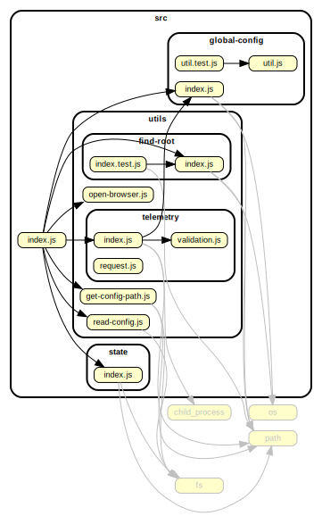

# @netlify/cli-utils

[netlify-cli](https://github.com/netlify/cli)'s [@oclif/command](@oclif/command) baseclass.

Provides a unified way to load and persist global and site level cli config and authenticated api.
Also allows commands to program against a consistent base-class api to enable changes down the road.

## Usage

```js
const Command = require('@netlify/cli-utils')

class OpenCommand extends Command {
  async run() {
    await this.authenticate()

    const api = this.netlify.api

    // authenticated api
  }
}

OpenCommand.description = `A description`

OpenCommand.examples = [
  'netlify open:admin',
  'netlify open:site'
]

OpenCommand.hidden = true

module.exports = OpenCommand

```

## API

Import the the base class and extend it, the same way you do with `@oclif/command`.

Commands that extend this base class get access to the [same api](https://oclif.io/docs/commands.html) as `@oclif/command` plus a few extra properties:


### `this.netlify.globalConfig`

Provides access to configuration stored in the users home folder under `~/.netlify`.
See [global-config](src/global-config/README.md).

### `this.netlify.state`

Provides access to site-level state relative to the `process.cwd`. (e.g. `project/.netlify/config.json`)
See [site-config](src/state/README.md)

### `this.netlify.api`

An instance of the [`netlify`](https://github.com/netlify/js-client) api client.  If access tokens are found in global config, then this client will automatically be authenticated.

### `this.netlify.site`

get current site context including root, configPath, and id (with getter and setter).

#### `this.netlify.config`

Get the configuration from `netlify.[toml/yml]`.

#### `this.authenticate()`

A method that will log the user in if they are not already logged in.  If the user is already logged in, this is a noop.


## Dependancy graph


